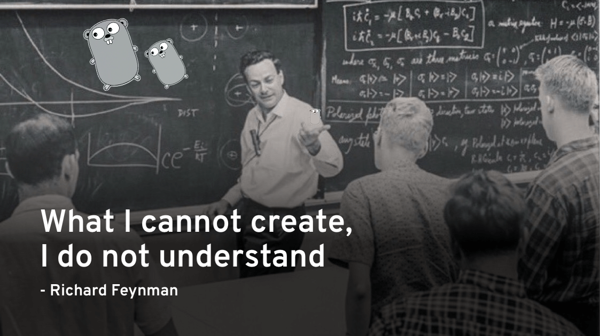

# 

## Table of contents(目录)

* [BitTorrent Client](#jump1)
* [Blockchain / Cryptocurrency](#jump2)
* [Command-Line Tool](#jump3)
* [Docker](#jump4)
* [Game](#jump5)
* [Neural Network](#jump6)
* [Programming Language](#jump7)
* [Shell](#jump8)

## Tutorials

#### Build your own `BitTorrent Client`

BitTorrent Client

* [**Go**: _Building a BitTorrent client from the ground up in Go_](https://blog.jse.li/posts/torrent/)
* 在Go中从头开始构建BitTorrent客户端

#### Build your own `Blockchain / Cryptocurrency`

* [**Go**: _Building Blockchain in Go_](https://jeiwan.net/posts/building-blockchain-in-go-part-1/)
* 在Go中构建区块链

* [**Go**: _Code your own blockchain in less than 200 lines of Go_](https://medium.com/@mycoralhealth/code-your-own-blockchain-in-less-than-200-lines-of-go-e296282bcffc)
* 用少于200行Go语言代码编写自己的区块链

#### Build your own `Command-Line Tool`

* [**Go**: _Visualize your local git contributions with Go_](https://flaviocopes.com/go-git-contributions/)
* 使用Go编写可视化的本地Git

* [**Go**: _Build a command line app with Go: lolcat_](https://flaviocopes.com/go-tutorial-lolcat/)
* 用 Go: lolcat 构建命令行应用

* [**Go**: _Building a cli command with Go: cowsay_](https://flaviocopes.com/go-tutorial-cowsay/)
* 用 Go: cowsay 构建CLI命令行

* [**Go**: _Go CLI tutorial: fortune clone_](https://flaviocopes.com/go-tutorial-fortune/)
* 基于Go语言的CLI教程：制造一个随机报价生成器

#### Build your own `Docker`

* [**Go**: _Build Your Own Container Using Less than 100 Lines of Go_](https://www.infoq.com/articles/build-a-container-golang)
* [**Go**: _Building a container from scratch in Go_](https://www.youtube.com/watch?v=8fi7uSYlOdc) [video]

#### Build your own `Game`

* [**Go**: _Games With Go_](https://gameswithgo.org/) [video]

#### Build your own `Neural Network`

* [**Go**: _Build a multilayer perceptron with Golang_](https://made2591.github.io/posts/neuralnetwork)
* [**Go**: _How to build a simple artificial neural network with Go_](https://sausheong.github.io/posts/how-to-build-a-simple-artificial-neural-network-with-go/)
* [**Go**: _Building a Neural Net from Scratch in Go_](https://datadan.io/blog/neural-net-with-go)

#### Build your own `Programming Language`

* [**Go**: _The Super Tiny Compiler_](https://github.com/hazbo/the-super-tiny-compiler)
* [**Go**: _Lexical Scanning in Go_](https://www.youtube.com/watch?v=HxaD_trXwRE) [video]

#### Build your own `Shell`

* [**Go**: _Writing a simple shell in Go_](https://sj14.gitlab.io/post/2018-07-01-go-unix-shell/)

#### Uncategorized

* [**(any)**: _From NAND to Tetris: Building a Modern Computer From First Principles_](http://nand2tetris.org/)
* [**Go**, _Let's Create a Simple Load Balancer_](https://kasvith.github.io/posts/lets-create-a-simple-lb-go/)

## How to contribute 
* Contributions are very welcome: [Submit tutorial](https://github.com/danistefanovic/build-your-own-x/issues/new)
* Help me to review [pending submissions](https://github.com/danistefanovic/build-your-own-x/issues) by leaving comments and "reactions"

## License

To the extent possible under law, [Daniel Stefanovic](http://twitter.com/danistefanovic) has waived all copyright and related or neighboring rights to this work.
